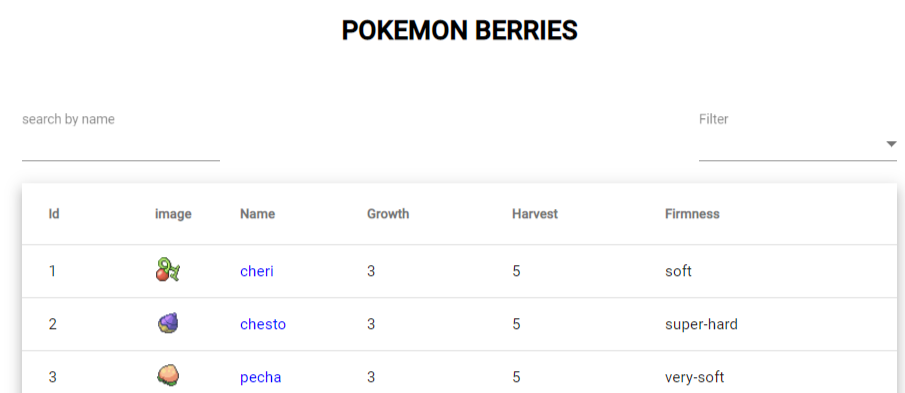

# Angular8PokemonTest Challenge. 

Create a catalog of all the berries from PackeAPI, where you can search, filter
and look their profile information with:
- Name
- Growth time
- Maximum number of these berries that can grow on one tree
- The firmness of this berry
- Whatever more you think is important!

IMPORTANT: we would also like to know who else has similar firmness and have link on their
profile.
It should have at least the following features:
- Catalogue page with a list of berries, with filter and sort options
- Detail page with the basic info and links to berries with same firmness

## To run project:
- npm i
- npm run start
- be happy :)

This project was generated with [Angular CLI](https://github.com/angular/angular-cli) version 8.3.6.

